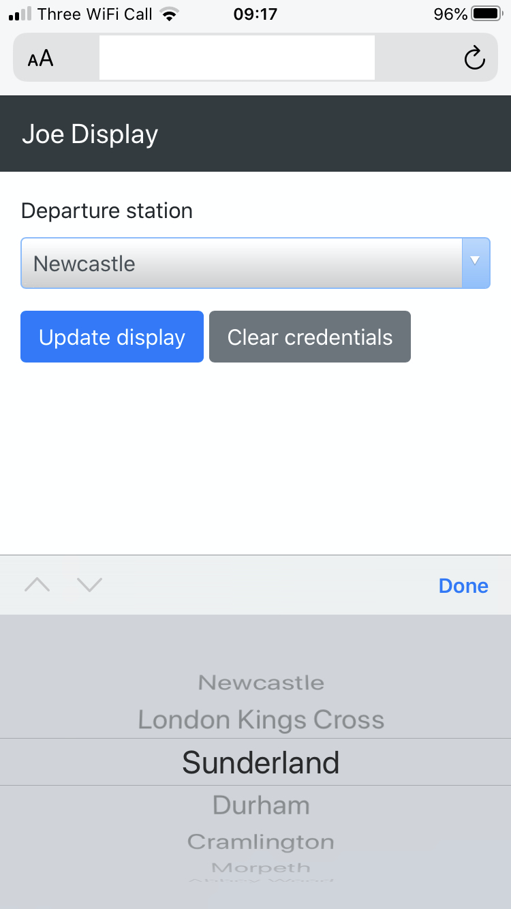

# UK Train Departures Board replica built with a Raspberry Pi and AWS IoT

[AWS IoT](https://docs.aws.amazon.com/iot/latest/developerguide/what-is-aws-iot.html) is a service that makes building _real_ IoT applications easier with important concerns like security, connectivity, discovery, deployment and device provisioning all handled comprehensively.

I'd strongly recommend reading [this introduction](https://docs.aws.amazon.com/iot/latest/developerguide/what-is-aws-iot.html) and also completing [this tutorial](https://docs.aws.amazon.com/iot/latest/developerguide/iot-moisture-tutorial.html).

This document contains notes about the implementation of a replica train departure board using a Raspberry Pi, an OLED panel and AWS IoT. It is not intended to be a guide or work out of the box for you. I make use of the `joedisplay` library that is currently located in this repository. For more information about the approaches taken to make the Raspberry Pi drive the display, consult the [README](README.md#driving-the-display-in-a-generic-way).

## Architecture

## Components

### Web UI

The web UI uses the AWS SDK for JavaScript to read and update the thing shadow. As the driver program running on the RPi is subscribed to the shadow delta update topic, the changes made to the shadow will immediately take effect. If the RPi is offline, the shadow is still updated and the updated values will be used when it next starts up.

The HTML and JavaScript are hosted from an S3 bucket in _website_ mode. Authorization is handled by entering an AWS access key and secret. This never leaves the browser, but a future improvement would be to make use of AWS Cognito or maybe an intermediate API.

It ain't pretty, but it works.

### Shadow Service

A _thing shadow_ is a JSON document describing the current state of a thing. It can be updated when the device is offline. Requests are made to change the state through the `desired` section. The actuated state is held in the `reported` section. The shadow service provides topics and endpoints to manage device shadows. See [Display driver with AWS IoT MQTT](README.md#display-driver-with-aws-iot-mqtt) for a demonstration of this.

### Current Shadow and Deltas MQTT topics

The shadow service exposes topics that get updated when a device shadow changes, as well as answering ad hoc requests for the status of a given thing.

### Display input topic

This MQTT topic is used to send _display events_ to the connected thing. See [Display Events](README.md#display-event).

### RPi

This is the Raspberry Pi running code from this repository. It is responsible for initiating the [sequences](#sequences) described below.

Code: [awsiot_display.py](awsiot_display.py)

### Producer command topic

This MQTT topic is used to trigger a refresh of data from a source that doesn't continually update. The driver running on the RPi publishes to the topic associated with the currently active stage.

### IoT Rules

An IoT Rule provides a way of interacting with other AWS resources from message published to a topic. It is configured with an SQL dialect. In this case a rule has been defined as `SELECT * FROM producers/train-display-board` with an action to execute the _Event producer_ Lambda function.

### Event Producer Lambda

This Lambda receives events from the above IoT rule action. Using values from the event, it requests data from the Transport API, converts the response into a _display event_ and writes it to the _display input topic_. This causes the panel to update.

Some applications may have a constant stream of events readily available, rendering this _pull_ approach unnecessary. Instead the _event producer_ could subscribe to an SNS topic, Kinesis stream, Kafka topic, web socket API, etc and continually convert the outside events/notifications into _display events_ that get written to the _display input topic_ in the same way.

Code: [event_producer.py](transport/event_producer.py)

### Transport API

[Transport API](https://www.transportapi.com) provides a set of services containing live transport information across the UK.

## Sequences

### Startup

- Raspberry Pi boots
- systemd starts `awsiot_display.py`
- Welcome message displayed on panel
- Subscription to `display/rpi/input` and thing shadow delta updates created
- Thing shadow for `rpi` is read
    - If not present, a the user is instructed to use the client application to setup
- Active `stage` and `data` is read from the _reported_ section of thing shadow
- An event is published to `display/producers/<stage>` containing the `client_id` and `data` object
- An AWS IoT rule invokes a registered Lambda function to the above topic
- Lambda function requests data from Transport API and publishes a display event to `display/rpi/input`
- `joedisplay` library takes over as per previous demos and renders the train depatures board

### Configuration change

- Device shadow has _desired_ properties updated by external system such as a web client
- Registered callback on Raspberry Pi receives the delta, updating the version of the shadow it has in memory
- As per the bootstrapping sequence, `stage` and `data` is read from the _desired_ section of thing shadow: the same data request sequence follows
- Raspberry Pi acknowledges the changes by moving them into the _reported_ section of the thing shadow

## Resources

The purpose of this document is to convey the ideas. As it stands the code won't run out of the box, you'll need to configure some AWS resources and setup your RPi. Maybe some Cloudformation will appear at some point.

At a high level you will need:

- Event Producer Lambda `transport/event_producer.py` deployed with secrets configured for access to the Transport API
  - Appropriate IAM role with policies to allow it to publish the topics
- AWS IoT _thing_ for RPi, with the certificates and keys installed
- AWS IoT _rule_ as discussed above
- IAM user for the web UI, should only contain a policy allowing access to a subset of resources in `iot-data`
- This repository cloned and dependencies installed on the RPi
- `awsiot_display.py` started and running on the RPi, a `systemd` unit is included if you want to run it at boot time

## Caveats

- The web UI doesn't use modern approaches, it's a jerry-rigged bit of HTML and JS. I will revisit this. As discussed, it also uses AWS credentials, with the AWS SDK responsible for signing requests made to the `iot-data` service. Naturally the credentials should **only** provide access to the resources within the shadow service that the UI needs to touch.
- Doesn't run out of the box. May add some automation to create the AWS resources if people actually use it.
