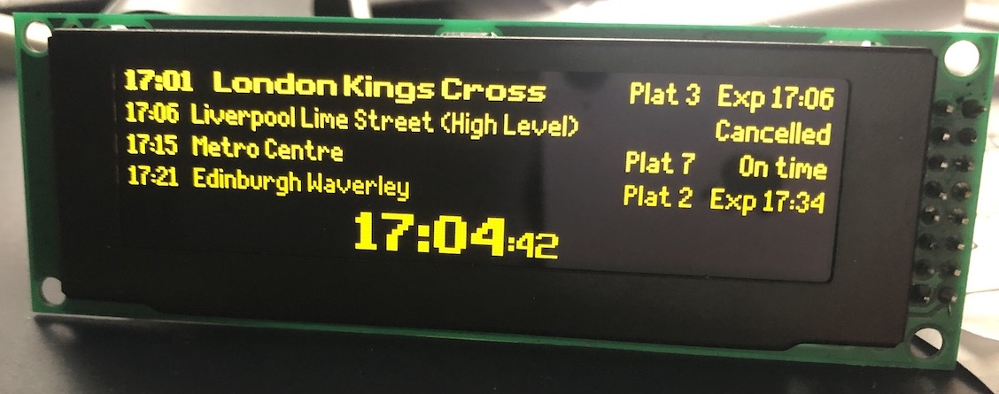
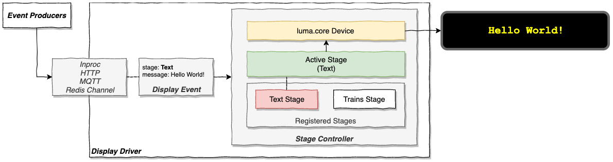
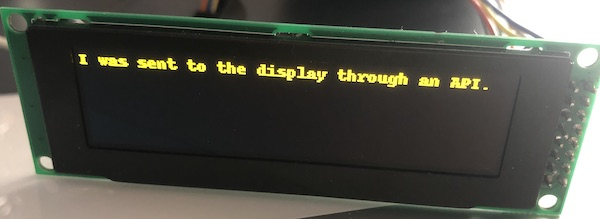
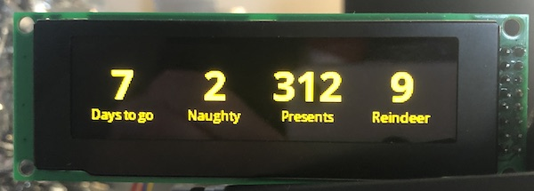
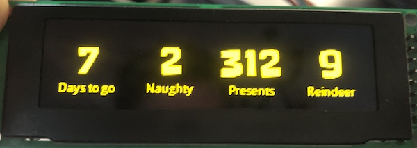
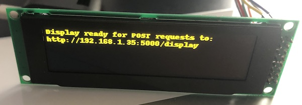
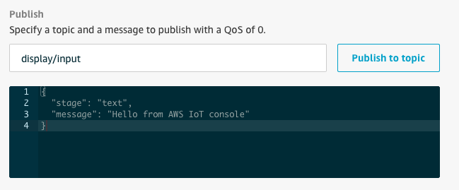
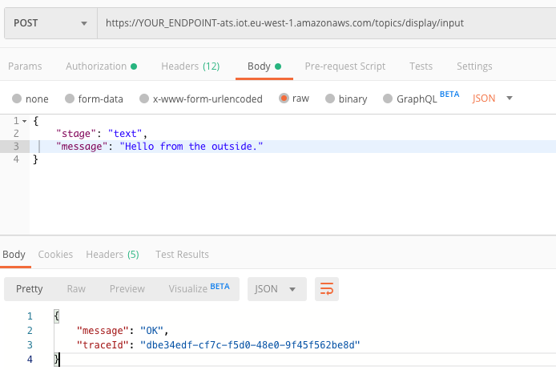

# joedisplay

Driving an OLED panel with a Raspberry Pi and AWS IoT



## Introduction

This repository demonstrates an approach for exposing an OLED panel connected to a Raspberry Pi as a _thing_ that accepts _display events_ from other components. Display events can originate in-process or come from external source such as an HTTP request, Redis PubSub channel or MQTT topic subscription. This allows for very simple programs to interact with the panel, using very little code.
  
  * [Design](#driving-the-display-in-a-generic-way)
  * [Examples](#examples)
    * [Self-contained](#self-contained-single-process)
    * [HTTP](#display-driver-exposes-http)
    * [Redis](#display-driver-subscribes-to-a-redis-channel)
    * [AWS IoT MQTT](#display-driver-with-aws-iot-mqtt)
 
This project started when my son asked me for a [replica train departures board](https://ukdepartureboards.co.uk/store/product/desktop-departures/) for Christmas. I thought this was a great idea and this looks to be a really neat implementation, but I wanted us to have a go at building one ourselves. I promised that if we failed miserably I'd buy him one!

After getting some off-the-shelf code up and running, I wanted to rethink the software. The train display board case study has been implemented using AWS IoT together with the approaches discussed in this document. See [UK Train Departures Board replica built with a Raspberry Pi and AWS IoT](AWSIOT.md).

If you are not interested in AWS IoT and just want to get a _very exciting_ train departures board up and running, you can try out the standalone implementation. You will need to control it by SSH-ing into your Raspberry Pi. See [Quick start for the impatient](#quick-start-for-the-impatient).

If you're interested in the generic approach of driving a display, see [Driving the display in a generic way](#driving-the-display-in-a-generic-way).

## Initial build

The following resources were essential:

- https://github.com/rm-hull/luma.core
- https://github.com/balena-io-playground/UK-Train-Departure-Display
- https://developer.transportapi.com/

I won't repeat the build instructions, but you will need:
- a Raspberry Pi. I used a Raspberry Pi Zero W which came with the pin headers pre-soldered
- an SSD1332 OLED panel with SPI interface, [this one, in yellow, worked](https://www.aliexpress.com/item/32988174566.html)
- Rasbian downloaded with Python 3 installed and etched to a micro SD card, SSH enabled and wifi setup
- some wires/solder to attach the panel to the Pi - [see wiring](https://github.com/balena-io-playground/UK-Train-Departure-Display#hardware)

## Goals

After getting it working, I realised I wanted:

- a simple way of displaying _anything_ on the OLED panel without writing more code every time. This is useful for extending this project and also allowing for reuse on other projects.
- to decouple the _data_ and _display_ aspects
- ability to update the display from other systems
- a way of controlling the station shown without having to SSH into the RPi, ideally through any web browser not on the same network as the RPi

I will discuss the design in the following sections and will provide some [examples](#Examples) along the way.

## Quick start for the impatient

If you just came here to get a working train departure board with the fewest moving parts, this section is for you.

Assuming you have the following:

- A RPi connected to the Internet
- Python 3.5+, virtualenv (or v-env) and pip installed
- Credentials for the Transport API, you can [sign up here](https://developer.transportapi.com/) with a GitHub account
- A clone of this repo

This approach has no external API or web interface. It runs as a single process. You can use the environment variable `DEPARTURE_STATION` (can be any [CRS code](http://www.railwaycodes.org.uk/crs/CRS0.shtm)) to select the departure station. Others to try are `KGX` and `EDB`.

```
$ cd joedisplay
$ virtualenv -p python3.8 venv # you might want to modify which python to use
$ source venv/bin/activate
$ pip install -r requirements.txt
$ export TRANSPORTAPI_APP_ID=<your app ID>
$ export TRANSPORTAPI_APP_KEY=<your app key>

$ DEPARTURE_STATION=NCL python transport_standalone.py
```

If you are interested in the full train departure solution that uses AWS IoT, it is [discussed here](AWSIOT.md). The rest of this document discusses the approach taken to interfacing with a panel.

## Driving the display in a generic way



### Key idea

Expose the OLED panel as a _thing_ that accepts _display events_ from other components. Display events could originate in-process or come from external source such as an HTTP request, Redis PubSub channel or MQTT topic subscription.

### Display event

A `Display Event` is a dictionary (encoded as a JSON object when being passed between systems) containing structured data to display on the OLED panel. It must contain a `stage` property to tell the display how to render the data. Data from the display event fills in _slots_ on the stage, such as a train station name or a temperature reading. Stages are covered in more detail in the following section.

A display event does not dictate _how_ the data should be displayed. It just conveys the structure. It is up to the `Stage` to display the event appropriately. Stages are discussed in the next section.

A display event looks like this:
```
{ "stage": "text", "message": "I was sent to the display through an API." }
```


### Stage

The `Stage` abstraction provides a plug-in model to render display events to a screen of any type.

A stage contains logic to _draw_ a given display event. Current implementations use `luma.core` to do this. Although `luma.core` supports a variety of devices (oled, lcd, led_matrix), `Stage` implementations for different display types could be added using drivers other than `luma.core` and `PIL`. Taking this to the extreme, a web browser engine even be used for rendering duties if a hi-res/colour screen is available. (Although it sounds crazy at first, I believe web browsers _do_ power a lot of modern display boards - at least judging by the error messages I sometimes see.)

A stage defines the shape of the dictionary it requires, although this is not formalised anywhere yet. If there is a need to display the data differently, this can be done by adding another `Stage` implementation.

For example, the `metrics` can be displayed with the following event.
```
{
    "stage": "metrics",
    "metrics": [
        {"value": "7", "label": "Days to go"},
        {"value": "2", "label": "Naughty"},
        {"value": "312", "label": "Presents"},
        {"value": "9", "label": "Reindeer"}
    ]
}
```


It is easy to change the font, depending on the use case.



This library will eventually contain more built-in `Stage` implementations. For example, the `metrics` stage shown above has _slots_ for four numbers (with optional labels). Clearly this stage can be reused across several projects. Having a toolbox of built-in stages will lower the barrier to entry for quick projects, particularly when teaching kids who are eager to get immediate results when starting out.

## Stage Controller 

A `StageController` receives a display event through its `event_handler` method. It selects a registered `Stage` implementation to use, based on the `stage` property in the event. The _set stage_ remains active until an event that specifies a different stage implementation arrives. In this scenario, the old stage is stopped and replaced with the new one.

The `StageController` is connected to an event source. This could be another thread within the same process that calls its `event_handler` method, or an API call/Redis channel/MQTT subscription.

### Display driver

The display driver brings the above pieces together. It connects to the display and event source, which sends events to a `StageController`, causing the display to update whenever an event arrives.

By exposing the display as an addressable _thing_ that renders events, this architecture will work well with IoT platforms such as AWS IoT. 

### Event producer

As the OLED panel _thing_ is effectively a dumb display, external processes can perform an HTTP request or write to a topic to update it. This is nice and flexible as in theory, data can now come from __any__ source and at any frequency. There is no need to poll for new data or refresh the display every minute if the data of higher velocity. Less code needs to run on the hardware driving the display. It also opens up the possibility of using smaller devices (such as microcontrollers running FreeRTOS) than a Raspberry Pi as all that is needed is an MQTT client and stage implementation, probably written in C. That said, considering its specification, the Raspberry Pi Zero W is a bargain.

At the simplest level, a thread within the same process as the display driver could serve as an event producer by periodically issuing a request to a remote API. It converts the response into a display event understood by a `Stage` registered on the display and passes it to the `event_handler` method on the stage controller. This causes the panel to update.

A more complex example would be for the display driver to subscribe to an Redis channel or MQTT topic and await display events. The `StageController` is passed the incoming display event.

A separate producer process would be responsible for transforming a stream of external data (for instance, stock prices or temperature readings) into a stream of display events - publishing them to the subscribed _display_ Redis channel or MQTT topic.

## Examples

### Available stages

See [example display events](example-display-events) to try each of the available stages out.

- `text`
- `scroll`
- `metrics`
- `train-display-board`

### Self contained, single process

The train departure board can be run as a single process.

```
$ export TRANSPORTAPI_APP_ID=<your app ID>
$ export TRANSPORTAPI_APP_KEY=<your app key>
$ DEPARTURE_STATION=NCL python transport_standalone.py
```

Code: [transport_standalone.py](transport_standalone.py)

### Display driver exposes HTTP

This example makes the display addressable over a single HTTP endpoint on your local network. Other processes can send a simple POST request to update the display.

```
$ PORT=5000 python api_display.py
```



Will listen on `PORT` and expose an endpoint `/display` that accepts `POST` requests. The request body should contain a display event. For example:

```
curl -X POST \
  http://192.168.1.35:5000/display \
  -H 'Content-Type: application/json' \
  -d '{
    "stage": "text",
    "message": "I was sent to the display through an API."
}'
```


Code: [api_display.py](api_display.py)

### Display driver subscribes to a Redis channel

This example makes the display addressable through a Redis channel. Other processes can connect to the same Redis and PUBLISH to this channel to update the display.

```
$ REDIS_HOST=127.0.0.1 DISPLAY_CHANNEL=display-input python redis_display.py
```

Will subscribe to `DISPLAY_CHANNEL`. The message data should contain a display event. For example:

```
127.0.0.1:6379> PUBLISH display-input '{"stage": "text", "message": "Hello from Redis."}'
(integer) 1
```

Code: [redis_display.py](redis_display.py). Requires Redis to be running somewhere you can access.

### Display driver with AWS IoT (MQTT)

The examples prior to this one are simple and possibly acceptable for hobby projects, but they gloss over a lot of important concerns. 

[AWS IoT](https://docs.aws.amazon.com/iot/latest/developerguide/what-is-aws-iot.html) is a service that makes building _real_ IoT applications easier with important concerns like security, connectivity, discovery, deployment and device provisioning are handled comprehensively. As this is a real-world platform, the setup is a bit more involved. You will need to provision your thing through the AWS IoT console and download the generated certificates to run this example. [This tutorial](https://docs.aws.amazon.com/iot/latest/developerguide/iot-moisture-tutorial.html) is a good starting point.

This example makes the display addressable through a MQTT topic. At its core, it's the same as above Redis channel example.

```
$ CA=certs/root.pem KEY=certs/private.pem.key CERT=certs/cert.pem.crt DISPLAY_TOPIC=display/input python iot_display.py
```

Will subscribe to the `DISPLAY_TOPIC`. The message data should contain the display event.

The AWS IoT console provides a MQTT client that enables us to publish to the display topic:



You can also write to this topic over HTTPS with an AWSV4 signed request:



As shown, AWS IoT exposes an endpoint to allow _things_ to be interacted with by other authorized components, anywhere in the world. This is exciting as allows us to build web interfaces and mobile apps to control the panel, which is one of the goals we set out to achieve. 

The full design of the train departure board project, using AWS IoT is [discussed here](AWSIOT.md).

## Conclusion

A generic approach for displaying data on an OLED panel has been proposed and implemented. Use of AWS IoT is of course optional, but is recommended for more serious use cases.

It would be easy to build some simple projects on top of these pieces.

- Days til Santa
- Temperature in different rooms
- Cloudwatch graphs (or indeed any time series)
- KPIs and other boring business dashboard things
- News headlines, stock prices, FX...

This was a fun hack. I've a few ideas about where to go next, time permitting. It's far from perfect and probably does not reflect best practices. It does not have any affiliation with my employers, past or present.

Thanks to the creators all of the referenced GitHub repositories as this wouldn't have been possible without them.

Comments, PRs, feedback and suggestions are most welcome. Twitter: <a href="https://twitter.com/alexjreid">@alexjreid</a>
